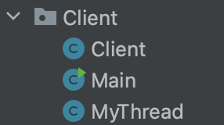

# MiniQQ
# 1 引言

本次大作业是编写一个网络程序。我选择的是写一个MiniQQ，MiniQQ麻雀虽小，但五脏俱全，使用GUI编程，使用网络编程，支持多组用户同时使用，同时使用了数据库来记录用户的账号，并发编程。通过对这个

## 1.1 设计目的

QQ是我们都在用的一个社交软件，其主要功能有很多，也正是因为其软件功能的繁多，不少用户选择了更简洁的微信，说到QQ，其最核心的功能就是能够让多用户聊天了。我实现的MiniQQ主要的具体功能如下：

（1）用户可以通过用户们、密码注册QQ账号，也可以通过用户们、密码登录QQ

（2）登录完成后，可以选择“双人连线”菜单栏下的“开始连线”，当满足连线要求的情况下，可以连线成功

（3）当双人连线的时候，可以和连线的对方发送消息，对方也会实时接受

（4）当双人连线的状态下，可以选择结束来结束连线

（5）不在连线状态的情况下，可以选择“其他“的“登陆”，再次登陆一个账号，也可以选择直接”退出“

## 1.2 设计说明

本程序采用 Java 程序设计语言，在 IntelliJ IDEA 平台下编辑、编译与调试。

详细的设计等后续再详细介绍。

# 2 总体设计

## 2.1 功能模块设计

本程序实现的主要功能有：

1. 用户登陆
2. 用户注册
3. 多用户同时登陆（Server Client）
4. 选择菜单面板
5. 聊天室功能

整体的代码项目框架为


## 2.2 流程图设计

程序整体流程如下图所示


# 3 详细设计

## 3.1 服务端设计

服务端主要由Server这个package。

下面分别包含

- Main
- Server
  - Server
  - ServerThread

Main里面直接调用了Server。Server有一个内部类，ServerThread和Server类。

Server类

- 成员变量
  - listener：ServerSocket类型，用于创建服务端socket
  - clientMap是HashMap<String, Socket> 类型，用于记录用户ID（String类型）和对应的Socket类型的客户端
  - PORT是8080端口
- 成员方法
  - Server()方法启动服务端，创建socket，一直循环，接受客户端的连接请求，开启一个独立的线程负责监听该客户端的消息
  - markID(String ID, Socket s)用于记录clientMap
  - getSocket(String ID)用户得到对应ID的socket

ServerThread类

ServerThread类继承了Thread类，是服务端线程类

- 成员变量
  - Socket类型的变量，是当前线程需要监听的客户端的socket
  - BufferReader类型的变量，用于处理接收到的信息流
  - msg是接收到的信息流的字符串
- 成员方法
  - 重写了run()方法，持续监听socket对应的客户端发来的信息；解析接收到的信息，转发给对应的客户端目的地。客户端目标地址根据信息中的目的地用户ID，获得目的地的socket。
  - sendMsg(String msg, Socket destination) 就是发送信息

## 3.2 客户端设计

客户端主要是由这部分组成

其中Main里调用了MyThread的方法，MyThread类是是Thread的子类，通过创建线程，实现多组用户并行。MyThread的成员变量为ControlOp的一个实例。createThread方法创建一个MyThread线程。

Client为主要是客户端类

- 成员变量
  - controlOp是ControlOp类型的变量，主要是进行一些控制的操作
  - IP是客户端的IP地址
  - PORT同理，是监听8080端口
  - socket是Socket类型的变量
  - BufferReader类型的变量，用于处理接收到的信息流
  - userID为用户ID
  - oppentID是对方的ID
- 成员方法
  - Client初始化客户端，启动一个socket。创建一个接受消息的线程，接收来自服务端转发的消息。
  - receiveMsg() 用于接受消息，重写了run函数来进一步处理接受后的信息，解析消息然后执行对应的操作，其中包含一些后续聊天时发送消息的判断情况。
  - sendMsg(String msg, int type)用于发送消息
  - setOppentID(String oppentID)用于设置对方的ID

## 3.3 数据库设计

数据库中的表为user表，其中存放字段信息有：用户ID userID，用户昵称 userName，用户密码 userPwd，用户是否登陆 state，用户是否空闲 busy。

除了代码部分，我们还需要做的是在mysql中建立这样一张表格，我使用的是Navicat，在Navicat中建立这样一张表，userName分别是四个同学的学号，为了方便，密码全是1。


代码部分主要是ConnPool类

- 成员变量
  - 连接数据库的一些需要的变量
  - 
  - 其中密码和jdbc连接需要改成你自己的，链接中的chat是我建立的数据库的名字，user表就在chat数据库中。
  - 并且需要注意的是，需要保证数据库时刻开着，保证jdbc和mysql的连接
- 成员方法
  - ConnPool()方法实例化对象
  - login(String, String)根据参数指定的用户名和密码，查找数据库中是否有匹配的记录，若有，返回用户ID，否则返回null
  - userExist(String)根据参数指定的用户名，判断数据库中是否存在此用户名的记录
  - regist(String, String)根据参数指定的用户名和密码，实现注册用户，在数据库中插入一条记录
  - loginOut(String)根据参数指定的用户ID，实现用户注销
  - setBusy(String, int)根据参数指定的用户ID和状态，更改数据库，用来更改用户的聊天状态
  - findOpponent(String)为用户查找可以连接的用户
  - getName(String)根据参数指定的用户ID，查找数据库中对应的用户名


## 3.4 登陆界面设计

Model包下的Login类实现了登录界面的绘制。包含

```java
    public JFrame loginFrame;   //登陆框架
    public JLabel loginLabel;   //登陆页面
    public JButton loginButton; //登陆按钮
    public JButton registButton;    //注册按钮
    public JTextField adminText;    //用户
    public JPasswordField pwdText;  //密码
    public JLabel photoLabel; //头像
```

Controller下的ControlOp里实现了login()方法，处理了登录的逻辑，实例化了一个登录界面，并且实现了一个监听方法loginButtnonLs，当用户单击loginButton时，loginButtnonLs负责执行有关算法。判断当前用户名和密码是否匹配，如果正确，隐藏登陆界面，显示聊天室界面；如果不正确，提示用户名或密码错误的提示。用户登陆成功后，实例化一个客户端实例，开启客户端socket线程。

## 3.5 注册界面设计

注册界面类似，Model下的Regist类实现了注册界面的绘制。包含

```java
    public JFrame registFrame;      //注册框架
    public JLabel registLabel;      //注册页面
    public JButton registButton;    //注册按钮
    public JButton returnButton;    //返回按钮
    public JTextField adminText;    //用户
    public JPasswordField pwdText;  //密码
    public JLabel photoLabel; //头像
```

Controller下的ControlOp里实现了点击注册事件，registButtonLs，处理注册的逻辑。单机registButtonL时，registButtonLs执行相关算法。判断是否数据库中存在相同用户名的数据，如果有，则判断注册无效，用户们已存在；如果没有，则执行jdbc语句，注册成功，写入数据库。

## 3.6 面板设计

面板主要是Model下的Manu类，Manu其实是一个JFrame，不过以成员变量的形式实现。成员变量如下：

```java
    private static final int width = 800;
    private static final int height = 580;
    private ControlOp controlOp;
    public JFrame Menu;
    public Connect connect;
    public MessagePanel messagePanel;
    private JMenuBar bar;
    private JMenu Double, Other;
    private JMenuItem  begin, fail, exit, login;
    private JFrame frame = null;
```

除了绘制GUI的部分外，比较重要的是实例化了一个controlOp用于进行相应逻辑的处理，此外实例化了一个connect用户负责用户之间的连接，messaghePanel是继承了JPanel，聊天界面，这个3.7着重阐述。

Manu类里，一方面是对整体GUI的一个绘制，另一方面是对一些按钮加了监听的事件，包括开始连线，结束连线，登录和退出。

## 3.7 聊天界面设计

本次我实现的聊天功能，是需要用户实现链接，你需要去主动匹配一位可以匹配的，即当前在线并且空闲没有在聊天的用户，匹配到了才可以进行聊天

Model下的Connect类主要负责处理一些用户连接上的属性判断以及变换，主要的两个变量，connectOver和isNetwork；当链接上了，就修改成员变量，通过成员变量来判断是否正在连接。

```java
package Model;

import javax.swing.*;

public class Connect extends JPanel {
    public boolean connectOver = true;         // 默认结束连接
    public boolean isNetwork = false;     //网络正在连接

    /**
     * 对决开始
     */
    public void begin() {
        isNetwork = true;
        connectOver = false;
    }
    /**
     * 处理对方终止链接的情况
     */
    public void getDisconnect() {
        JOptionPane.showMessageDialog(null, "对方终止链接");
        connectOver = true;
        isNetwork = false;
    }
}
```

Controler下的ControlOp主要负责菜单界面的所有逻辑，包括注册界面，登录界面和聊天界面。注册界面和登录界面上文已经介绍过了，接下来主要介绍其中的聊天界面。他有一个方法是beginPlay，主要负责请求双人连线的逻辑，判断可以找到连线的，客户端发送信息

```java
    /**
     * 请求双人连线
     *
     * @throws SQLException 数据库异常
     */
    public void beginPlay() throws SQLException {
        String i = ConnPool.findOpponent(userID);
        //查找不到对象
        if (i == null) {
            JOptionPane.showMessageDialog(null, "无匹配对象");
            return;
        }
        //根据查找到对手，根据反馈信息解析对手ID和昵称
        String[] rs = i.split(":");
        opponentID = rs[0];
        opponentName = rs[1];
        System.out.println("请求连线...\n" +
                "找到的可以连线的ID为" + opponentID);
        client.setOppentID(opponentID);
        //发送类别为3内容为#的信息
        client.sendMsg("#", 3);
    }
```

Model下的MessagePanel是用来绘制对话框的，成员变量如下

```java
private ControlOp controlOp;
    private JScrollPane consoleScroll, messageScroll;
    public JLabel idLabel,photoLabel,toolsLabel;
    private MyTextPane console;     //显示消息的控制台
    private JTextArea message;     //待发送的信息
    public Connect connect;   // 连接器
    private ImageIcon bgImg = new ImageIcon("src/images/Menu/blue.png");
    private ImageIcon txImg = new ImageIcon("src/images/login/touxiang.png");
    private ImageIcon toolsImg = new ImageIcon("src/images/Menu/QQ.png");
```

- 成员方法
  - MessagePanel(ControlOp controlOp, Connect connect)初始化一个MessagePanel，进行绘制
  - public void keyTyped(KeyEvent e)重写了键盘响应，因为需要处理，如果没有连接的状态，是不能发送信息的，因为不知道要发给谁。并且空消息也是不能发的
  - addMsg(String msg, int type)用于在聊天窗口添加信息
  - 还有一些工具类
- 内部类
  - MyTextPane继承自JTextPane，对聊天室的一些字体进行了设置


# 4 测试与运行

创建数据库chat，并且创建表


为了验证多个用户，我们需要设置运行，在IDEA里，我设置了两个，一个是启动Server，一个是准备Login，其中Login的configurations里面


需要在

Modify options里选中Allow multiple instances，才能并行运行

我们运行Server，并且运行两个Login


Login执行的时候，会跳出一个界面


你可以选择输入用户名和密码直接登录


也可以选择注册，点击注册，会跳到注册界面


假如我注册，3200103626 1的账号，他会提示用户们已存在。


当然也是可以注册成功的


查看数据库，发现数据库里果然多了一条信息


接下来，我们正常登录两个账号


3200103626同学申请连线


此时弹出


选择否的话，显示


再度连线


连接成功，可以分别在各自对话框中打字，输出会显示在输出屏里，并且显示不同的颜色，还会显示打字的时间


点击结束，就可以结束链接


会提示我是否确定结束连线

否的话无事发生

是的话，会显示，对方终止链接


对话框也会显示 连线结束


我也可以选择，其他中的登录，再次登录一个账号


也可以直接退出


在非连接的情况下，我发送信息，会显示


如果发送空消息会显示


